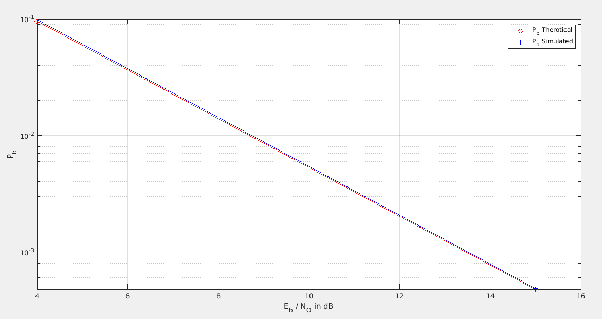

NOTE: You can find Matlab codes and Simulink models under the q1, q2, and q3 folders.
============
Introduction
============

In this lab report, I analyzed different binary modulation types using
Matlab. Digital communications are a crucial part of today\'s society.
While transmitting binary signals are simple in theory, we encounter a
greater problem while transmitting. Even though digital communication
systems are more reliable than analog communications, still there is a
probability for the channel noise to corrupt incoming messages. While
this probability is small for binary transmission, m-ary transmissions
such as 16-ary transmission systems can send more data from within given
bandwidth. But this tradeoff comes with a price. Grouping bits together
to save bandwidth also increases the chance of data being corrupted
during transmission. However, with optimization, an ideal system with a
low bit error rate and small bandwidth can be created.

In this lab report, I analyzed several modulation techniques for digital
communications. Matlab and Simulink scripts can be found under folders.
However, some scripts may take a long time to complete.

All these modules on the report follow the same structure. Random
integers are created at the rate of 48kbps. This binary string is passed
to an M-ary mapper to be mapped to transmission symbols. These symbols
are transmitted using several different modulation techniques on a
channel with random Gaussian noise. The bit/noise power rate will be
changed to check different channel states. From the channel, the
received noisy symbol string will be demodulated and converted to binary
symbols. After that, a comparison will be made to check the error rate
between received and transmitted binary symbols.

Question 1)
===========

a. 
---

In the phase shift modulation technique (PSK), the transmitted signal is mapped
by the incoming signal to change its phase. This means we simply shift the
phase of the output signal during transmission.

Figure 1: 4-ary PSK transmission symbols. Each data has a different phase
on Transmission

Figure 2 : Simulink model for PSK transmission.

The probability for a symbol to be corrupted on the channel is dependent
to channel noise and signal power. As can be seen in the given graph,
increasing bit energy will significantly reduce the error probability for a
given system.

Figure 3 : Bit error rates for different (Eb/N0) values for 16-ary PSK
system.

By increasing transmission energy(voltage) or decreasing channel noise
constant, the probability of a corrupted bit during transmission can be
reduced.

b.
--

By increasing the number of bits grouped to form a single transmission
symbol, we can reduce bandwidth. However, this process will also
increase the probability of the symbol becoming corrupted during
transmission.

Figure 4 : Comparison of bit error
probabilities for 4-ary, 8-ary, and 16-ary PSK systems.

As can be seen from the given graph, increasing the number of bits
required to form a single transmission symbol will also increase the bit
error probability.

| M-ary PSK | Data Rate | Bandwidth | BER(Binary Error Rate) (For Eb/No = 5dB)  |
|-----------|-----------|-----------|------------------------|
| 4-ary     | 2 MBps    | 1 MHz     | 0.00597                |
| 8-ary     | 3 MBps    | 1 MHz     | 0.03187                |
| 16-ary    | 4 MBps    | 1 MHz     | 0.08295                |

As can be seen from the given table, increasing the M value will also
increase the number of bits transmitted over a channel with the same
bandwidth but It'll also increase the probability of a bit being
corrupted during transmission. So M-ary grouping is a tradeoff between
increased data rate and increased bit error during transmission.

Question 2)
-----------

a.
---

On QAM modulation we again change the phase of the outgoing signal
according to the coordinate system positions. And for PAM modulation, we
are sending integer values for grouped binary symbols

Figure 5 : 4-ary QAM modulation values.

Figure 6 : Simulink Scheme for QAM modulation.

Figure 7 : Simulink scheme for PAM modulation.

In this question, we tried to analyze the difference between QAM and PAM
modulations.

Figure 8 : Bit Error vs Eb/No graph for QAM(4-ary and 16-ary) and PAM(binary and 16)

| M-ary Modulation Type | Data Rate | Banwidth | BER(Binary Error Rate)(For Eb/No = 5db)    |
|-----------------------|-----------|----------|------------------------|
| Binary PAM            | 1 MBps    | 1 MHz    | 0.005989               |
| QAM                   | 2 MBps    | 1 MHz    | 0.005989               |
| 16 -ary PAM           | 4 MBps    | 1 MHz    | 0.1593                 |
| 16-ary QAM            | 4 MBps    | 1 MHz    | 0.04194                |

From the table, we can say that QAM is superior to PAM modulation for
higher M values. But for lower values, they are almost identical. But for
higher M values QAM has a much lower error rate than PAM modulation.

### b.
---

Figure 9 : PSK vs QAM modulation comparison for 16-ary grouping.

Since both modulation techniques use phase modulation while
transmitting data, these modulations are similar. However, QAM
modulation is superior to PSK modulation due to its phase mapping.

Question 3)
-----------

For this question, we used Frequency Shift Keying modulation to transmit
and receive data over a noisy channel. FSK uses frequency shifting over a
sinusoidal to transmit data.

### a.
---

Figure 10 : FSK modulation Simulink Model.

Figure 11 : FSK modulations for binary,
4-ary, 8-ary, and 16-ary over 12 dB Eb/NO noisy channel.

From the given graph, we can see that there are some missing values.
These missing values are simulation values for 4-ary, 8-ary and 16-ary
transmissions. These values are red as 0 from the simulation. Since our
calculated values are very small, this proves our results.

For the bandwidth part, we know that the bandwidth is changing as the formula
of M\*Rs. The symbol rate is constant over all simulations. So out
theoretical results will be as follows:

BFSK = 2 \* 1k = 2KHz

4-ary FSK = 4 \* 1k = 4KHz

8-ary FSK = 8 \* 1k = 8Khz

16-ary FSK = 16 \* 1k = 16Khz

Figure 12 : BFSK spectrum.

Figure 13 : QFSK spectrum.

Figure 14 : 8FSK spectrum.

Figure 15 : 16FSK spectrum.

### b.

Figure 16 : FSK modulation BER comparison for varying Eb/NO and M(2, 4, 8, 16) values.

For this part of the problem, we analyzed the FSK modulation technique for
different M values. The results are similar to the other techniques.
If we increase the M value, the number of bits that we can transmit over a given
period or in a short Data rate will increase but the chance of the transmitter
the signal is corrupted during transmission over a noisy channel will also
increase as well.

| M-ary FSK  | Bandwidth | Data Rate | BER(Binary Error Rate) (For Eb/No = 5db) |
|------------|-----------|-----------|------------------------|
| Binary FSK | 2 KHz     | 1 KBps    | 0.0048                 |
| 4-ary FSK  | 4 KHZ     | 2 KBps    | 0.0137                 |
| 8-ary FSK  | 8 KHz     | 3 KBps    | 0.0358                 |
| 16-ary FSK | 16 KHZ    | 4 KBps    | 0.1052                 |

As can be seen on the graph, the data rate and BER(Binary error rate) 
complement each other. Increasing M(which will increase data rate)
will increase BER as well.

Conclusion 
===========

Digital communication is a crucial part of today's technology. Almost
all data transmission is done by digital communication techniques. While
the data error rate is relatively small compared to analog systems,
some transmission techniques allow us to change the error rate. However,
the chaning error rate will decrease our data rate. So different modulation
techniques create a tradeoff between error rate versus data rate. In
this lab experiment, we analyzed different modulation techniques such
as QAM, PAM, PSK, and FSK.
